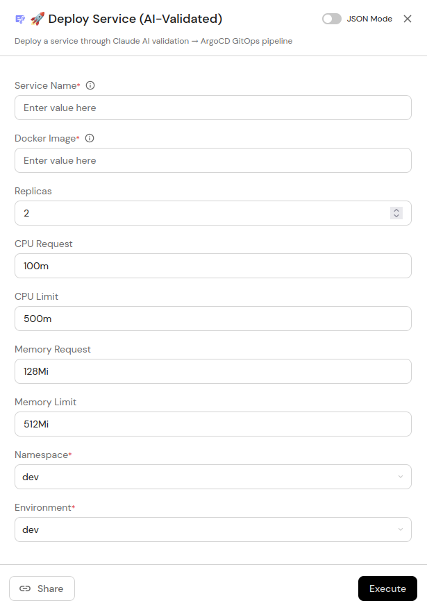
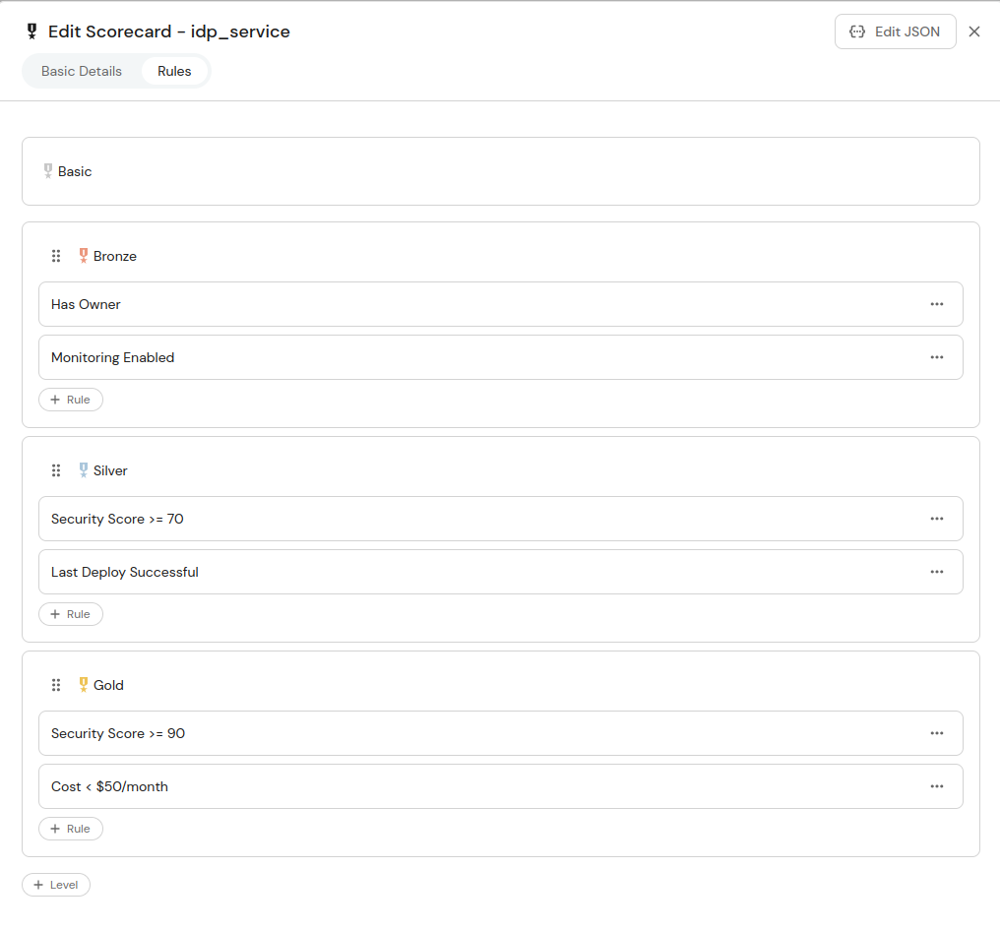
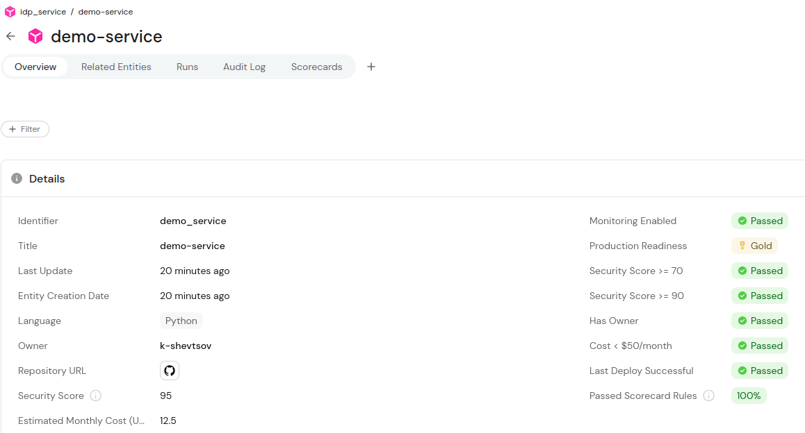
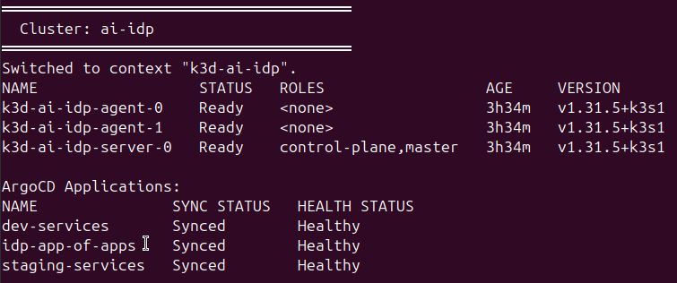
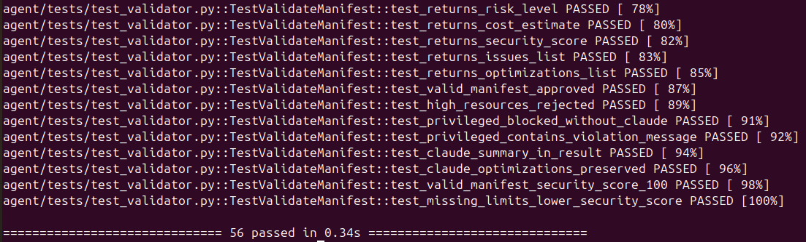

# AI-Enhanced IDP

> Evolution of [mini-idp](https://github.com/k-shevtsov/mini-idp) — from basic self-service deployments to an **AI-Native Internal Developer Platform** where every deployment is validated by Claude before it reaches the cluster.

[](https://github.com/k-shevtsov/ai-enhanced-idp/actions/workflows/validate-manifest.yml)
[](https://www.python.org/)
[](https://k3d.io/)
[](https://argoproj.github.io/cd/)

## What This Is

A self-service developer platform where a developer fills out a form in Port.io, and the system:

1. **Validates** the deployment manifest through a Claude AI agent (security, cost, resources)
2. **Blocks** dangerous deployments automatically — privileged containers, missing limits, excessive resources
3. **Deploys** approved services via ArgoCD GitOps to a k3d cluster
4. **Registers** deployed services in the aiops-anomaly-detector monitoring platform
5. **Updates** the Port.io service scorecard with security score and cost estimate

No kubectl. No manual YAML. No unsafe deployments reaching the cluster.

## Architecture

```
Developer → Port.io Self-Service UI
↓
GitHub Actions Workflow
↓
┌─────────────────────────────┐
│   Claude Validation Agent   │
│  (claude-haiku-4-5)         │
│  ✓ Security policy check    │
│  ✓ Resource limits check    │
│  ✓ Cost estimation          │
│  ✗ Block if risk=critical   │
└─────────────────────────────┘
↓ approved
GitOps commit to repo
↓
ArgoCD auto-sync
↓
k3d cluster (ai-idp)
├── dev namespace
└── staging namespace
↓
aiops-anomaly-detector (monitoring)
↓
Port.io Scorecard update
```

## Screenshots

### Self-Service Action — Deploy Service form


### Production Readiness Scorecard — Bronze / Silver / Gold levels


### Service entity — Gold level, 100% scorecard rules passed


### Cluster status — 3 nodes + ArgoCD App-of-Apps Synced/Healthy


### Test suite — 56 unit tests, 0 real API calls


## Claude Agent — How It Works

The validation agent in `agent/validator.py` runs two stages:

**Stage 1 — Static checks** (free, instant, deterministic):
- Privileged containers → score=0, instant block, Claude never called
- Missing resource limits → score deduction
- Root user, hostNetwork, hostPID → violations
- Image tag `:latest` → warning

**Stage 2 — Claude analysis** (only if static checks pass):
- Sends manifest + static analysis results to `claude-haiku-4-5`
- Returns structured JSON: `approved`, `risk_level`, `issues`, `optimizations`, `summary`
- Results merged with static score and cost estimate

```python
# Privileged container blocked without Claude API call
result = validate_manifest({"privileged": True, ...})
# → approved=False, risk_level="critical", security_score=0
# → claude.messages.create() never called → $0 API cost
```

## Stack

| Component | Technology | Why |
|-----------|-----------|-----|
| Developer Portal | Port.io (free tier) | Self-service UI, scorecards, blueprints |
| AI Validation | Claude Haiku (`claude-haiku-4-5`) | Low latency, cost-effective for pre-deploy checks |
| GitOps CD | ArgoCD v2.13.3 | App-of-Apps pattern, automated sync |
| Cluster | k3d (`ai-idp`, 1 server + 2 agents) | Local dev, fast iteration |
| CI/CD | GitHub Actions | Workflow trigger from Port.io |
| Helm | service-template chart | Golden path for all services |
| Monitoring | aiops-anomaly-detector | Deployed service registration |

## Quick Start

```bash
git clone https://github.com/k-shevtsov/ai-enhanced-idp
cd ai-enhanced-idp

cp .env.example .env
# Set ANTHROPIC_API_KEY in .env

python -m venv .venv && source .venv/bin/activate
pip install -r requirements.txt

make up        # k3d cluster + ArgoCD (~2 min)
make status    # verify 3 nodes + ArgoCD apps Synced/Healthy
make test      # 56 unit tests, no API key needed
make validate  # live Claude validation demo (requires API key)
```

## Makefile Targets

| Target | Description |
|--------|-------------|
| `make up` | Start k3d cluster + install ArgoCD |
| `make down` | Stop cluster |
| `make clean` | Delete cluster (full reset) |
| `make status` | Nodes + ArgoCD apps status |
| `make test` | Unit tests (56 tests, mocked Claude) |
| `make test-int` | Integration tests (real API) |
| `make validate` | Run Claude validation on sample manifest |
| `make demo` | Full demo flow |

## Test Coverage
agent/tests/test_cost_estimator.py     13 tests  parse_cpu, parse_memory, estimate_cost
agent/tests/test_security_checker.py   18 tests  static security policy checks
agent/tests/test_validator.py          15 tests  Claude agent (fully mocked)
tests/integration/                      5 tests  structure, scripts, YAML validity
──────────────────────────────────────────────────
Total                                   51 tests  0 real API calls in unit suite

## Port.io Configuration

**Blueprints:** `idp_service`, `idp_deployment`

**Scorecard — Production Readiness:**

| Rule | Level | Check |
|------|-------|-------|
| Has Owner | Bronze | `owner` field is set |
| Monitoring Enabled | Bronze | `monitoring_enabled = true` |
| Security Score ≥ 70 | Silver | Claude agent score |
| Last Deploy Successful | Silver | `last_deploy_status = success` |
| Security Score ≥ 90 | Gold | Claude agent score |
| Cost < $50/month | Gold | Estimated monthly cost |

## ArgoCD App-of-Apps

```
idp-app-of-apps  (watches argocd/apps/)
├── dev-services      (watches gitops/overlays/dev/)
└── staging-services  (watches gitops/overlays/staging/)
```

## Related Projects

| Project | Description |
|---------|-------------|
| [`aiops-anomaly-detector`](https://github.com/k-shevtsov/aiops-anomaly-detector) | AIOps platform — deployed services register here |
| [`ai-incident-response`](https://github.com/k-shevtsov/ai-incident-response) | Incident response automation with Claude |
| [`mini-idp`](https://github.com/k-shevtsov/mini-idp) | Predecessor — Port.io + kind + kubectl apply |

## Why This Over mini-idp

| Feature | mini-idp | ai-enhanced-idp |
|---------|----------|-----------------|
| Deployment validation | None | Claude AI agent |
| Security policy | Manual | Automated static + AI |
| Cost visibility | None | Per-deployment estimate |
| GitOps pattern | Direct kubectl | ArgoCD App-of-Apps |
| Test coverage | Minimal | 56 unit + integration tests |
| Scorecard | Basic | Bronze/Silver/Gold levels |
